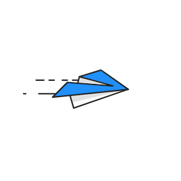

# 👋 This is Yash Chaudhary A.K.A busybee

  

#### I'm a full stack web developer. I'm proficient in ReactJs,NuxtJs, VueJs, NextJs, NodeJs 
#### And have experience with animation library such as lottie js and material.

  

####  Have knowledge and experience in App Dev through flutter and react native.
####  I'm a Blockchain enthusiast and love to build decentralised applications. I have a experience and quite good skill set in Python, C and C++.  

